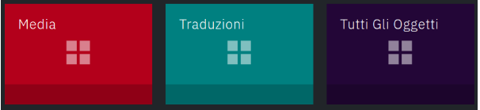
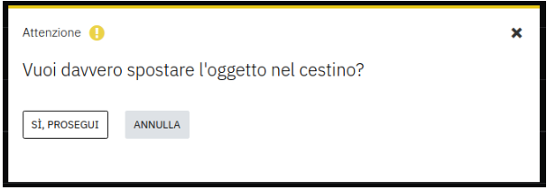
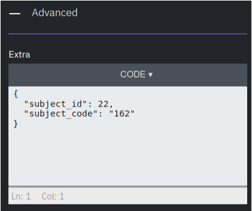

- [Premessa](#premessa)
- [Accesso](#accesso)
  - [Reimposta password](#reimposta-password)
- [Dashboard](#dashboard)
- [I moduli](#i-moduli)
  - [Moduli di entità](#moduli-di-entità)
  - [Traduzioni](#traduzioni)
  - [Cestino](#cestino)
  - [Utenti di sistema](#utenti-di-sistema)
  - [Profilo Utente](#profilo-utente)
  - [Amministrazione](#amministrazione)
  - [Modellazione](#modellazione)
- [Menu superiore](#menu-superiore)
- [Elenco oggetti](#elenco-oggetti)
  - [Filtro di ricerca](#filtro-di-ricerca)
  - [Paginazione](#paginazione)
  - [Modifica e Cestino](#modifica-e-cestino)
- [Dettaglio singolo oggetto](#dettaglio-singolo-oggetto)
  - [Azioni principali](#azioni-principali)
  - [Proprietà principali](#proprietà-principali)
  - [Altre proprietà](#altre-proprietà)
    - [Lingua e traduzioni](#lingua-e-traduzioni)
    - [Metadati](#metadati)
    - [Cartelle](#cartelle)
    - [Avanzate](#avanzate)
    - [Relazioni](#relazioni)
- [Categorie e tag](#categorie-e-tag)
- [Utenti e ruoli](#utenti-e-ruoli)
- [Endpoint e permessi](#endpoint-e-permessi)

# Premessa

In questo documento si illustrano sinteticamente alcune caratteristiche della piattaforma BEdita Manager

# Accesso

L'accesso al BEdita Manager avviene tramite autenticazione con Nome utente e Password.

<figure>

<figcaption><b>Figura 1. Particolare di Pagina di login</b></figcaption>
</figure>

## Reimposta password

Se hai dimenticato la password, puoi reimpostarla: cliccando sul link "Hai dimenticato la password?", si entra nella pagina di reimposta password.

<figure>

<figcaption><b>Figura 2. Reimposta la password</b></figcaption>
</figure>

# Dashboard

Una volta effettuato l'accesso, si accede alla Dashboard che mostra tutti i moduli del progetto API di riferimento. Alcuni moduli sono sempre presenti, altri sono specifici dell'API BEdita collegata all'istanza del BEdita Manager.

<figure>

<figcaption><b>Figura 3. Particolare di una Dashboard</b></figcaption>
</figure>

<figure>

<figcaption><b>Figura 4. Particolare dei moduli speciali nella Dashboard</b></figcaption>
</figure>

Cliccando sul box di un modulo, si entra nella pagina principale del modulo. In ogni momento si può navigare da un modulo ad un altro, usando il menù sulla barra di navigazione che si trova nella parte alta di ogni pagina.

<figure>

<figcaption><b>Figura 5. Particolare del menù superiore</b></figcaption>
</figure>

L'elenco dei moduli può variare a seconda dei ruoli dell'utente che ha effettuato l'accesso. Per alcuni ruoli, i moduli di amministrazione e di sistema non sono visibili.

A seconda della configurazione della piattaforma, specifici moduli saranno accessibili in sola lettura o in lettura/scrittura per specifici ruoli.

# I moduli

La piattaforma è organizzata in moduli: si tratta di pagine dedicate per la gestione dell'intero sistema.

## Moduli di entità

Ogni modulo si riferisce ad una o più entità del sistema.
Segue una tabella riassuntiva dei moduli/entità principali:

<table>
<caption style="caption-side: bottom;"><b>Tabella 1. Moduli ed entità</b></caption>
<tr><th>Modulo</th><th>Descrizione</th></tr>
<tr><td>Documents</td><td>I documenti</td></tr>
<tr><td>Images</td><td>Le immagini</td></tr>
<tr><td>Videos</td><td>I video</td></tr>
<tr><td>Audio</td><td>Gli audio</td></tr>
<tr><td>Files</td><td>I file</td></tr>
<tr><td>Media</td><td>I media: immagini, video, audio e file</td></tr>
<tr><td>Translations</td><td>Le traduzioni</td></tr>
</table>

La gestione dei dati degli oggetti passa attraverso i moduli: accedendo ad un modulo, è possibile inserire, modificare, visualizzare ed eliminare dati di pertinenza del modulo.

Il funzionamento generale dei moduli è omogeneo e fondamentalmente si basa su due pagine principali di interazione: la pagina di elenco oggetti e la pagina di dettaglio singolo oggetto (per maggiori informazioni si vedano rispettivamente le sezioni [Elenco oggetti](#elenco-oggetti) e [Dettaglio singolo oggetto](#dettaglio-singolo-oggetto)).

Alcuni moduli si riferiscono ad entità astratte, che corrispondono a più entità concrete; ad esempio Media, che raggruppa tutte le entità multimediali Audio, Video, File e Image. I moduli che consentono di gestire più tipi di entità sono contraddistinti visivamente dall'icona di molteplicità, si veda figura seguente.

<figure>

<figcaption><b>Figura 6. Moduli astratti / multi-entità</b></figcaption>
</figure>

Esistono alcuni moduli "speciali": Traduzioni, Cestino, Utenti di sistema, Profilo Utente, Amministrazione, Modellazione.

## Traduzioni

Il modulo Translations ("Traduzioni") consente di gestire le traduzioni degli oggetti in lingue diverse. Al pari degli altri moduli, nella pagina di indice mostra un elenco di oggetti: le traduzioni (per maggiori informazioni sulla navigazione nella pagina indice di un modulo, si veda sezione [Elenco oggetti](#elenco-oggetti)). Aprendo una traduzione in "modifica", si potranno tradurre tutti i campi, con una vista che consente di visualizzare il contenuto originale sulla destra, la traduzione sulla sinistra.

<figure>

<figcaption><b>Figura 7. Traduzione di un oggetto</b></figcaption>
</figure>

## Cestino

Il modulo Trash ("Cestino") è dedicato alla gestione degli oggetti che sono stati eliminati (eliminazione "soft"). Fintanto che gli oggetti si trovano nel cestino, non saranno "visibili" negli altri moduli. Questi oggetti possono essere ripristinati o eliminati definitivamente (eliminazione "hard"). La gestione della pagina del Cestino è analoga a quella di una qualsiasi pagina di Elenco oggetti (si veda sezione [Elenco oggetti](#elenco-oggetti)), fatta eccezione per le operazioni puntuali di "Ripristina" e "Elimina" che rispettivamente consentono di ripristinare e eliminare definitivamente un oggetto, rimuovendolo dal cestino in entrambi i casi.

<figure>

<figcaption><b>Figura 8. Modale di conferma di eliminazione definitiva di un oggetto dal cestino</b></figcaption>
</figure>

## Utenti di sistema

Il modulo Users ("Utenti") è dedicato alla gestione degli utenti che accedono al BEdita Manager. La gestione della pagina del modulo è analoga a quella di una qualsiasi pagina di Elenco oggetti (si veda sezione [Elenco oggetti](#elenco-oggetti)).

## Profilo Utente

## Amministrazione

## Modellazione

# Menu superiore

TODO

 - accesso ai moduli
 - ricerca
 - vai a id / uname

# Elenco oggetti

Ogni modulo si apre su una pagina indice di elenco degli oggetti, di cui sono visibili alcune proprietà principali. La pagina offre una serie di strumenti eterogenei: paginazione dei risultati, filtro di ricerca, esportazione elementi in formato CSV (e altri), azioni su più elementi, cestino, creazione di un nuovo oggetto, operazioni puntuali su singoli oggetti ("Modifica" e "Cestina").

<figure>

<figcaption><b>Figura 9. Elenco degli oggetti per il modulo Posizioni/Locations</b></figcaption>
</figure>

## Filtro di ricerca

La pagina di elenco degli oggetti ha una sezione dedicata alla ricerca di contenuti: consente di individuare elementi che rispondono a specifici criteri di ricerca.

Si può effettuare la ricerca a partire da una o più parole chiave (campo "Cerca") e/o usare "Più filtri" (cliccando il bottone omonimo si apre una sezione con ulteriori opzioni per la ricerca).

<figure>

<figcaption><b>Figura 10. Filtro di ricerca, dettaglio con "Più filtri"</b></figcaption>
</figure>

I filtri di ricerca possono variare per modulo, ma contengono parti invarianti: il campo libero di ricerca (campo "Cerca") e il filtro "Solo i miei contenuti".

Attraverso il campo libero "Cerca" si effettua una ricerca testuale sui contenuti; con "Solo i miei contenuti" attivo, il sistema mostrerà soltanto i contenuti creati o modificati dall'utente autenticato.

Il bottone "Più filtri" (diventa "Meno filtri" quando cliccato) consente di mostrare (e nascondere) la sezione che contiene opzioni avanzate di ricerca per il modulo.

La ricerca viene applicata quando si preme sul bottone "Cerca".
Una volta lanciata la ricerca, il sistema presenta i risultati ed evidenzia la presenza di un filtro attivo, persistente nella pagina.

L'utente può navigare in altre pagine, e quando tornerà sulla pagina di elenco oggetti del modulo sulla quale aveva applicato il filtro, troverà ancora il filtro attivo, fintanto che non deciderà di disattivarlo (premendo il bottone "Reset filtri").

<figure>

<figcaption><b>Figura 11. Esempio di filtro di ricerca attivo per testo "barbarano" e stato "On" su modulo Media</b></figcaption>
</figure>

## Paginazione

Quando l'elenco è numeroso, il sistema organizza i dati secondo una paginazione, che consente di navigare gli elementi in pagine separate, con un limite di elementi per pagina (dimensione della pagina).

<figure>

<figcaption><b>Figura 12. Elenco degli oggetti per il modulo Immagini/Images, con paginazione</b></figcaption>
</figure>

L'utente può variare il valore del limite di elementi per pagina (Dimensione della pagina) e la pagina di risultati agendo sulla sezione di controllo della paginazione, visibile in alto ed in basso in prossimità dell'elenco. Quando il numero di risultati è inferiore al limite di elementi per pagina, la sezione di controllo della paginazione non viene mostrata.

<figure>

<figcaption><b>Figura 13. Particolare della sezione di controllo della paginazione, con numero risultati, dimensione della pagina e pagine di paginazione</b></figcaption>
</figure>

## Modifica e Cestino

L'elenco degli oggetti consente di agire puntualmente su ognuno di essi attraverso appositi bottoni "Modifica" e "Cestina".

Cliccando su "Modifica" si accede al dettaglio del singolo oggetto (per maggiori informazioni, si veda la sezione Dettaglio singolo oggetto).

Cliccando su "Cestina" si apre una modale di conferma, che consente all'utente di decidere se vuole veramente spostare l'elemento nel cestino. Un oggetto che si trova nel cestino può essere ripristinato dalla pagina del cestino (per maggiori informazioni, si veda la sezione [Cestino](#cestino)).

<figure>

<figcaption><b>Figura 14. Modale di conferma su operazione "cestina"</b></figcaption>
</figure>

[TODO]

- elenco campi sortable
- export

# Dettaglio singolo oggetto

Nella pagina di dettaglio del singolo oggetto si possono visualizzare i suoi dati, le sue proprietà e relazioni, ed è inoltre possibile effettuare una serie di operazioni come gestire relazioni con altri oggetti, salvare, clonare, bloccare e cestinare.

## Azioni principali

Le azioni principali di interazione con l'oggetto sono visibili nell'area dei comandi, nella parte sinistra della pagina, in prossimità del quadrato del modulo, e tipicamente sono: "Salva", "Clona", "Blocca", "Cestina".

<figure>

<figcaption><b>Figura 15. Bottoni disponibili nel dettaglio di un Documento non "bloccato" (immagine a sinistra) e di un Documento "bloccato" (immagine a destra)</b></figcaption>
</figure>

"Salva" consente di salvare le modifiche apportate all'oggetto, rendendole persistenti.

"Clona" crea un nuovo oggetto che è una copia dell'oggetto di partenza.

"Blocca" rende l'oggetto "bloccato", ovvero non cestinabile e con alcuni dati non modificabili ("Nome univoco" e "Stato" risultano in sola lettura, in un oggetto "bloccato"). Una volta applicato il blocco e possibile revocarlo con apposito pulsante "Sblocca" che sarà visibile al posto del "Blocca" (si veda Figura 15).

"Cestina" sposta l'oggetto corrente nel cestino. Per dettagli sull'uso del cestino, si veda la sezione [Cestino](#cestino).

## Proprietà principali

Nella parte centrale della pagina si trovano le proprietà, raccolte in gruppi di sezioni espandibili e collassabili al click, ad eccezione delle proprietà principali che sono sempre visibili in alto.

Le proprietà non raggruppate in sezioni e che non fanno parte del gruppo principale, si trovano in una sezione "Altro".

Ogni modulo può essere personalizzato a sistema, per cui i nomi e i contenuti delle sezioni della pagina del dettaglio dell'oggetto possono variare a seconda dell'istanza del Manager.

Nella parte destra della pagina si trovano proprietà speciali come il "Nome univoco", lo "Stato", le date di pubblicazione ("Data inizio pubblicazione" e "Data revoca pubblicazione"). Sempre sul lato destro, si hanno le sezioni "Lingua e traduzioni", "Metadati" e "Avanzate".

<figure>

<figcaption><b>Figura 16. Particolare di blocco centrale di una pagina di dettaglio di un singolo oggetto</b></figcaption>
</figure>

## Altre proprietà

### Lingua e traduzioni

In questa sezione si gestiscono la lingua principale dell'oggetto e le sue eventuali traduzioni. Cliccando su "Aggiungi traduzione", il sistema apre una nuova pagina che consente di creare una nuova traduzione per l'oggetto.

Quando vi sono traduzioni, compaiono in box appositi che mostrano il titolo e la lingua della traduzione, e consentono di aprire la traduzione in un'altra pagina (bottone "Apri") o rimuovere la traduzione dall'oggetto ("Rimuovi").

<figure>

<figcaption><b>Figura 17. Lingua e traduzioni di un oggetto</b></figcaption>
</figure>

Tutte le traduzioni sono visibili e gestibili attraverso il modulo omonimo (per maggiori dettagli, si veda la sezione [Traduzioni](#traduzioni)).

### Metadati

Sono informazioni in sola lettura sull'oggetto: l'identificatore univoco "id", la proprietà "locked" (si veda sezione [Azioni principali](#azioni-principali) per maggiori informazioni), le date di creazione e di ultima modifica, la data di pubblicazione, il nome utente di chi ha creato l'oggetto, il nome utente di chi ha effettuato l'ultima modifica sull'oggetto, ecc.

<figure>

<figcaption><b>Figura 18. Metadati di un oggetto di tipo Video</b></figcaption>
</figure>

### Cartelle

[TODO]

### Avanzate

Ogni entità ha a disposizione un campo "extra" all'interno del quale si possono immagazzinare dati serializzati nel formato JSON. Il campo "extra" è visibile e modificabile nella sezione "Avanzate".

<figure>

<figcaption><b>Figura 19. Dati avanzati per un oggetto</b></figcaption>
</figure>

### Relazioni

[TODO]

# Categorie e tag

[TODO]

# Utenti e ruoli

[TODO]

# Endpoint e permessi

[TODO]
